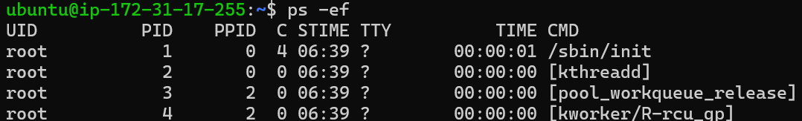
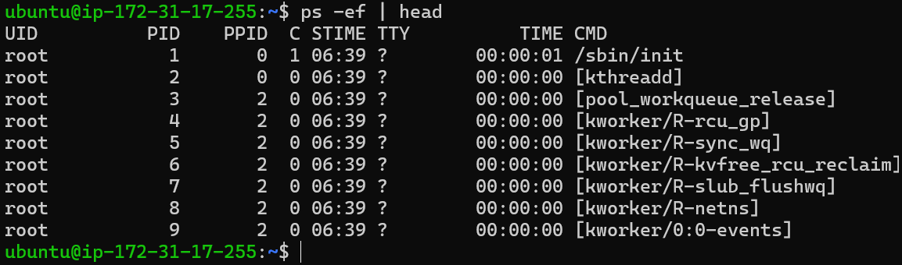
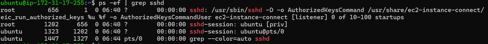
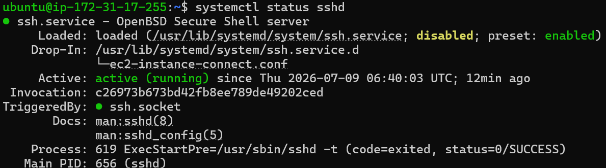
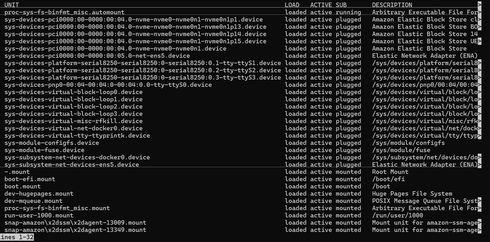
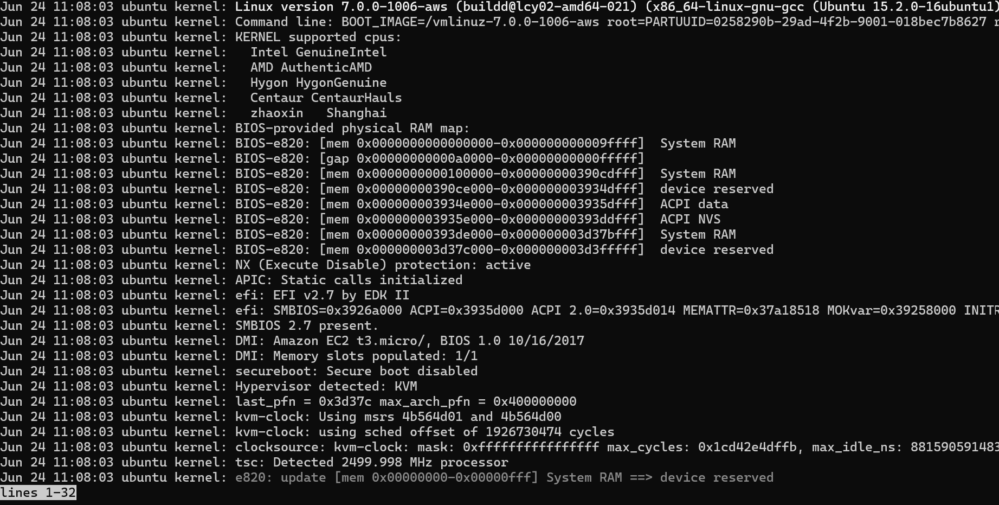
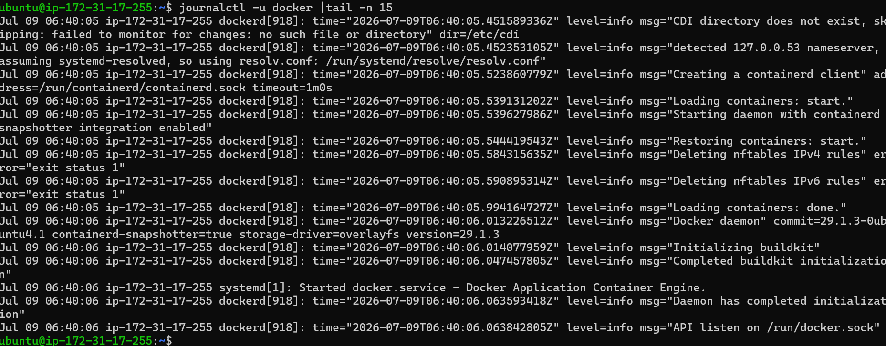

# Linux Practice:Processes and Service

# Process Checks
- 1. Show All Running Processes 
 
   ps -ef 

   

- 2. Show Frist few running processes 

   ps -ef | head

   

- 3. Find a specific Process

  ps -ef | grep sshd

      
    

##  Systemd Coomands

-  Check SSH Service Status
  Syntax :- 
        systemctl status sshd

    

-  systemctl list-units

      

- journalctl

   

- journalctl -u docker |tail -n 15

      

