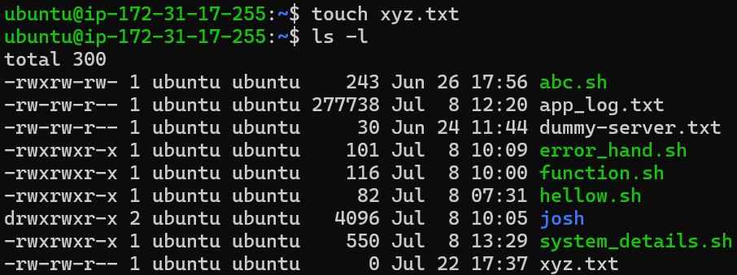
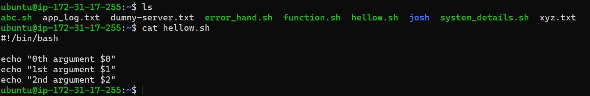
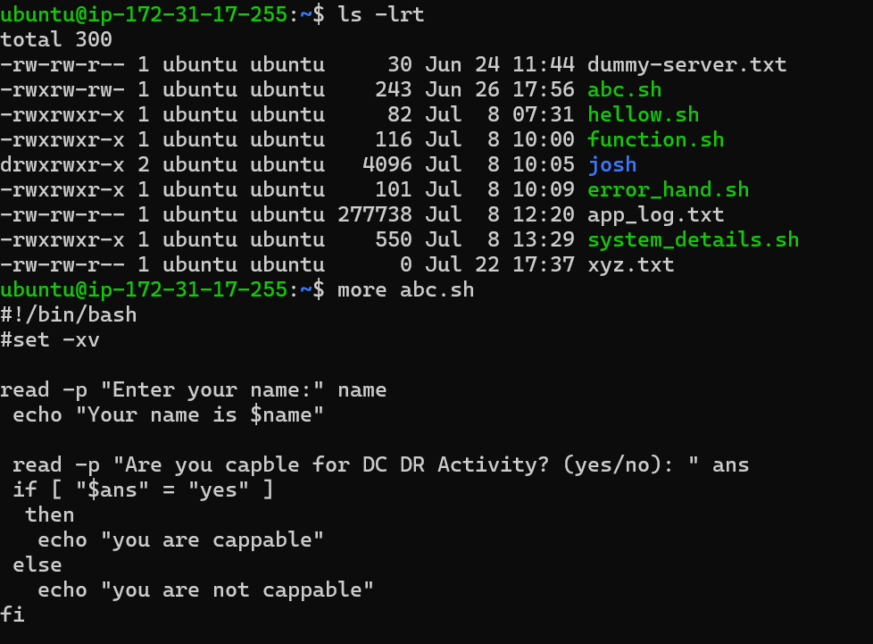
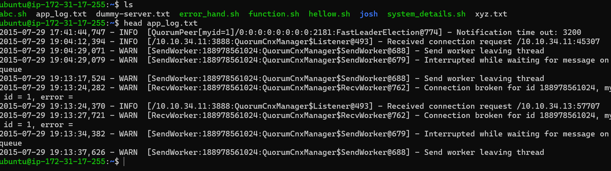
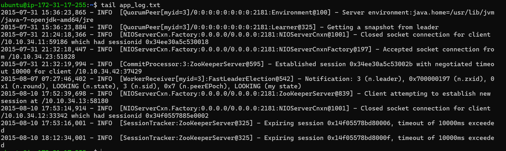
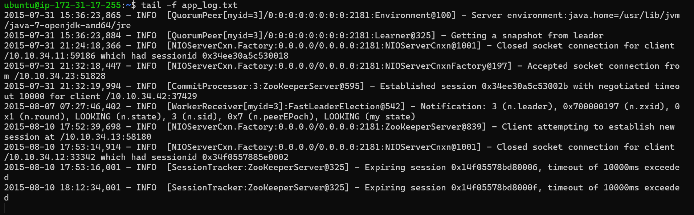

# Day 06 – Linux Fundamentals: Read and Write Text Files

# touch
  -  used to create empty file

# cat 
 - used to read content of a file 

 

# data display
  - more
    we can only display data by more command cannot add or insert data  
 

# head 
- is used read a frist 10 lines of file by default if you want more line used -n no_of_line you want to read
    

# tail 
- is used a last 10 line of a file by default if you want more line used -n no_of_line you want to read
   

# tailf 
- is used to monitor a file contineously if file is contineously increasing

