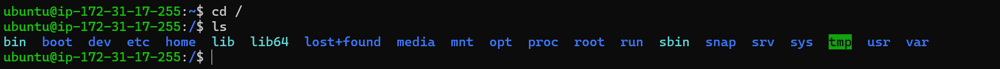
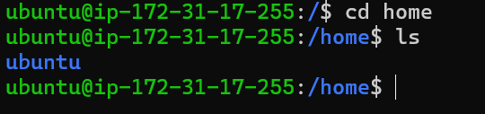
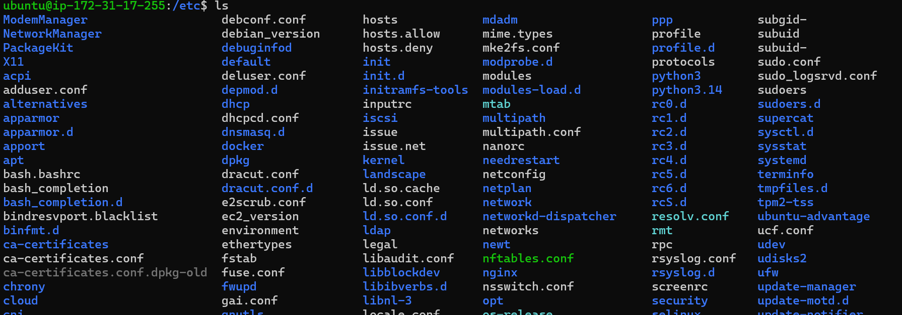
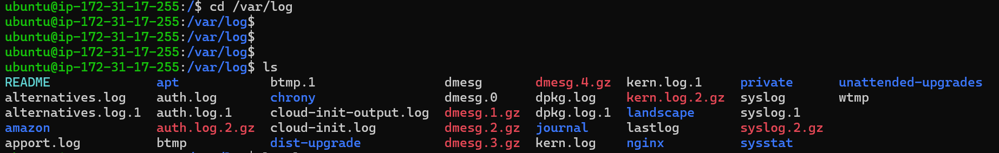
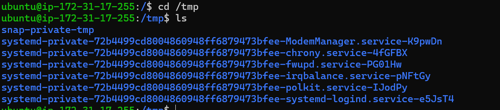
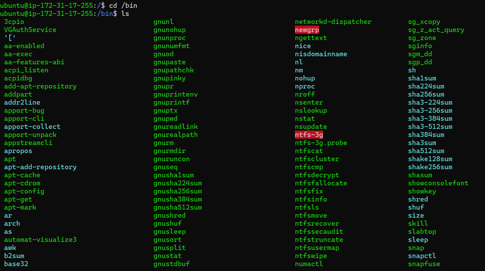
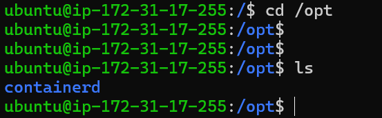

# Day 07 – Linux File System Hierarchy & Scenario-Based Practice
# 1 / (Root Directory)
- Meaning :- starting point of the Linux file system.
ex:- cd /
 You will see directories like:
   
# 2 /home
- stores normal users 
- Each user gets a separate directory where they can store personal file and customize their env.
   
# 3 root
- the /root directory is the home directory of the root(administrator) user.
- /root belong only to the root user.
- normal user generally cannot access it.
# 4 /etc
- The /etc directory stores system-wide congiguration file.
- It contains settings thet control the opretating system,services,applications,networking,user,and security.
    
/etc contains configurations files for the Linux operating system and installed services.
# 5 /var/log
- The /var/log directory stores log files generated by the operating system and applications.
ex. - System logs
    - Authentications logs.
   
var/log stores log files used for monitoring,debugging and troubleshooting system and applications issue.
# 6 /tmp
- The /tmp directory is used to store temporary files created by users and applications.
- Files in this directoy may be deleted automatically during reboot or by system cleanup.

# 7 /bin
- The /bin directory contains essential executable commands required for basic system operation.

# 8 /usr/bin
- The /usr/bin directory stores most user-level executable programs and utilities installed on the system.
# 9 /opt
- The /opt directory is used for optional or thied-party software packages thet are not part of the default Linux installation.
- ex:- Oracle Database, Tomscat.
   