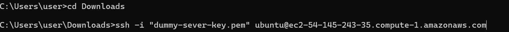
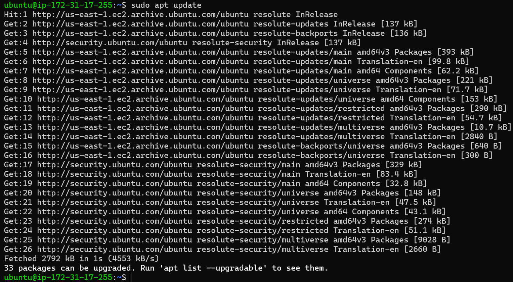
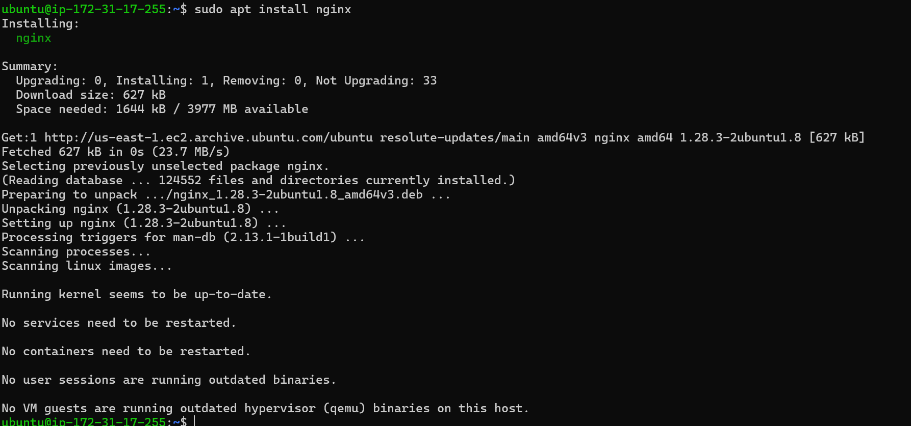
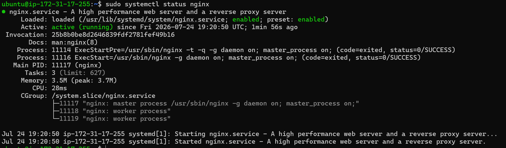
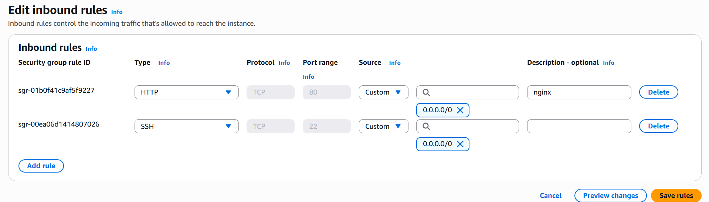
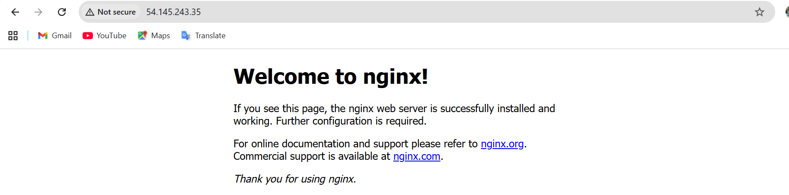
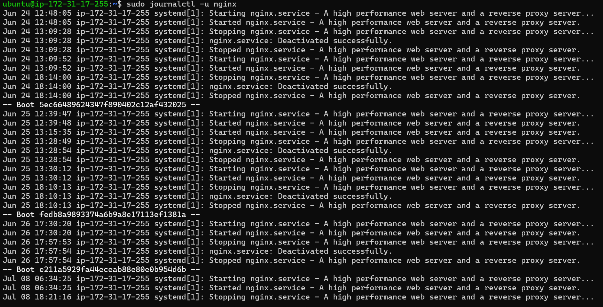
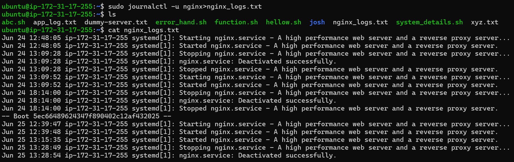

# Day 08 – Cloud Server Setup: Docker, Nginx & Web Deployment

- Connect to EC2 instance via SSh
 
- Upadate System
 

- Install Nginx

- Check Staus

- Open port for nginx
-- nginx runs on http port 80 

- Test Web Access:

 

 - View Nginx Logs
 

 - Save Logs to File
   
   
 
