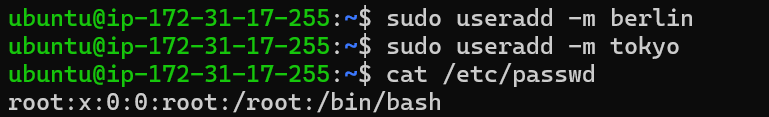
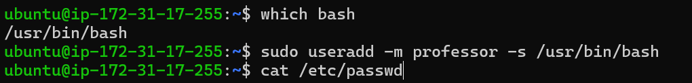
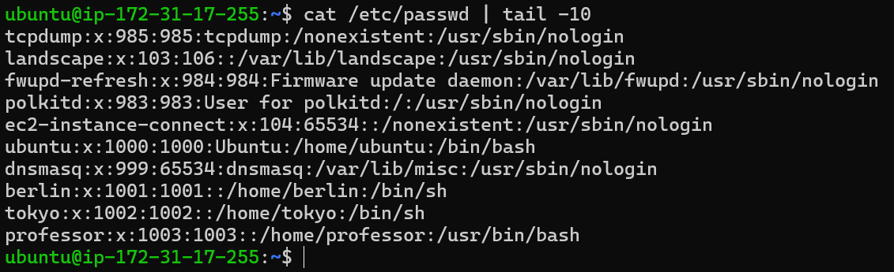
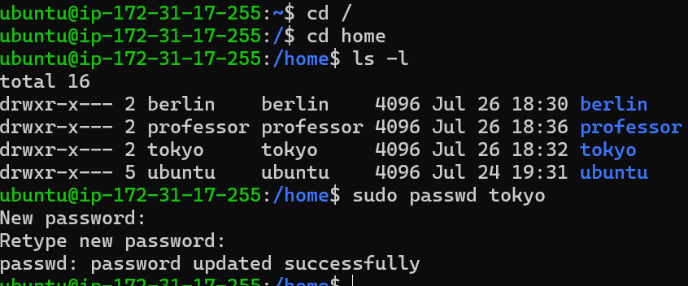
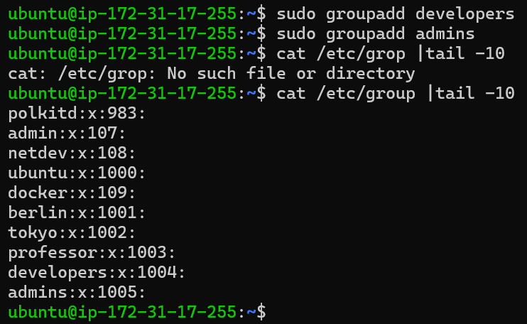
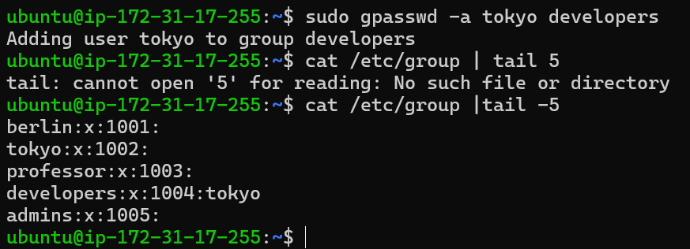
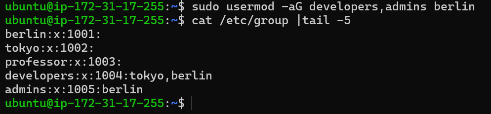
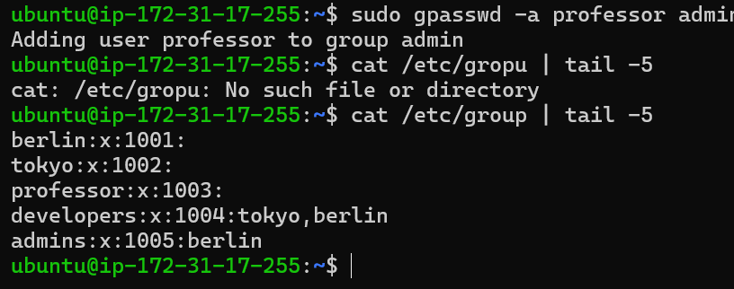
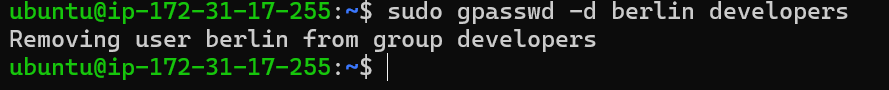

# Day 09 – Linux User & Group Management Challenge

# Task 1 Create User

- Create Users home directory

    

- create user with default shell bash

    

- Check user

 

- Set Password for user

   

# Task 2 Create Group

- create group 

    

# Task 3 Assing to Gropus

- Assign users
 
   - tokyo → developers

   

   - berlin → developers + admins (both groups)

   

   - professor → admins
    
     

   - Remove user from group

   

   

