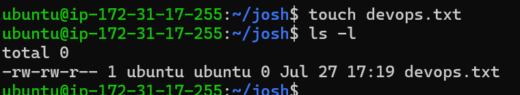
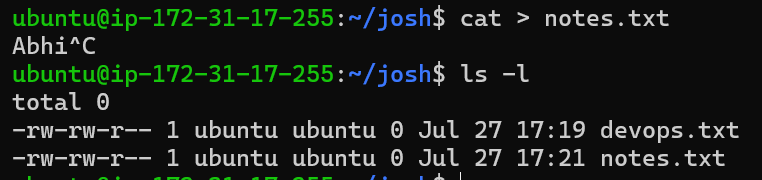
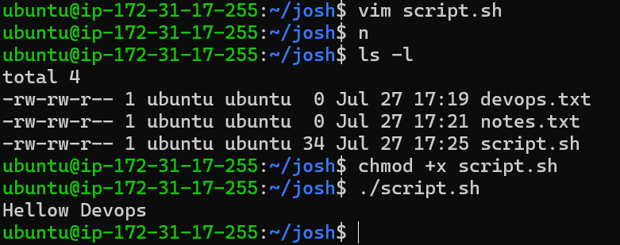
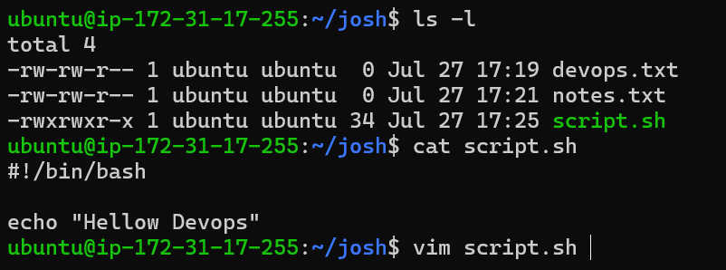
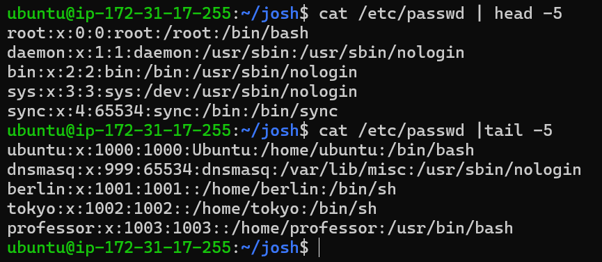
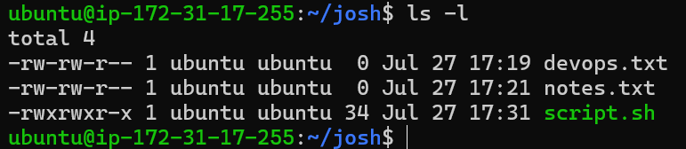
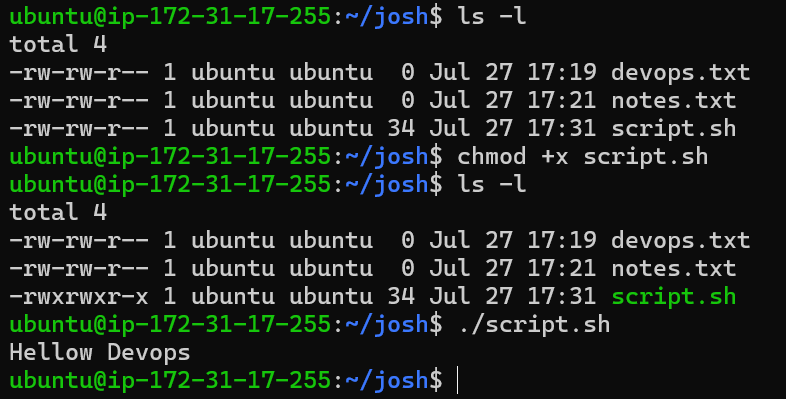
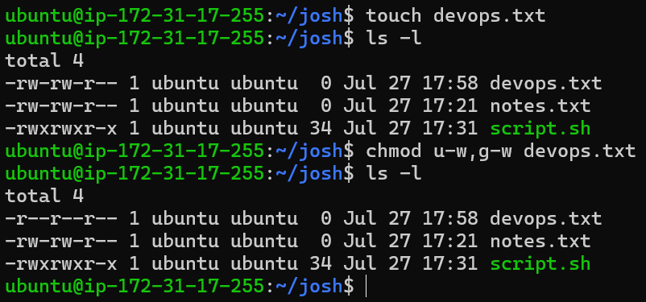
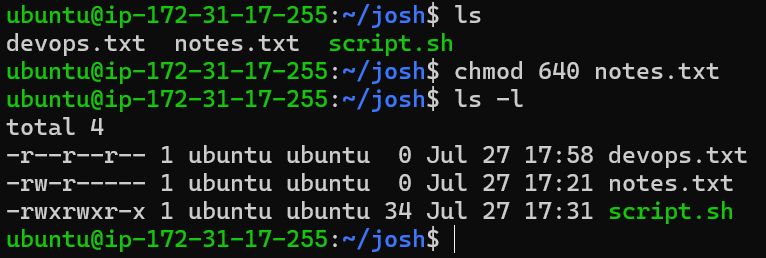
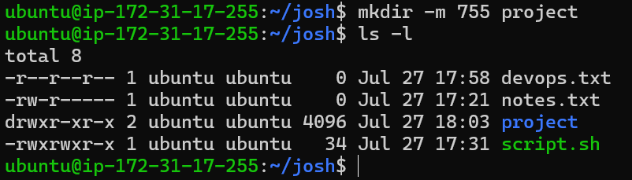

# Day 10 – File Permissions & File Operations Challenge
#  Create Files

- Create empty file devops.txt using touch

   

- Create notes.txt with some content using cat 
   
   

- Create script.sh using vim with content: echo "Hello DevOps"

    

# Read Files 

Read file using cat & vim editor

  

  

# Understand Permissions

 - In Linux when we create any file and directory then 3 types of permissions allocated to it 
    - Read
    - Write
    - execute
 - when we create file/directory then there are three deflaut user are present
    - owner of file/directory
    - group by file/directory
    - other user of file/directory
    - ex.
         below snapshot file name note.txt has permissions are
         user = read,write
         group = read,write
         other = read

         

  - changing permissions of file /directory by using chmod command in Linux
     Syntax :- chmod (permissions) <file_name>

# Modify Permissions

- Make script.sh executable

   

- Set devops.txt to read-only (remove write for all)

   

- Set notes.txt to 640
    
    

- Create directory project/ with permissions 755

    

# Try writing to a read-only file 

 - A read-only file cannot be modified because it does not have the write (w) permission.
 
- A script without execute (x) permission cannot be run directly, even if it has read permission. Linux   returns Permission denied until execute permission is granted with chmod +x.

