## Git Branching & Working with GitHub

# Git Branching & Working with GitHub

* A branch is a separate line of development in Git.It allows you to work on a feature or fix without directly changing the main branch.

   main
  |
  |------ dev
  |        |
  |        |--- add new feature

* Branches allow developers to work independently on features or fixes without affecting the stable main branch until the changes are tested and ready.

* If any wrong changes done in main branch it may impact your production so its better to create branch & do your changes.

* HEAD tells Git where you are currently working.Usually, HEAD points to your current branch.

* When you switch branches, Git changes your working directory files to match the files stored in that branch.

## Branching Commands

* List all Branches

   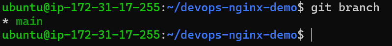

- The * means you are currently on that branch.

* Create a new branch called feature-1 & switch to branch

    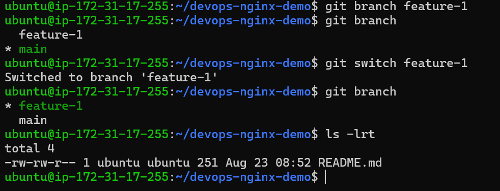

* Create a new branch and switch to it in a single command — call it feature-2

      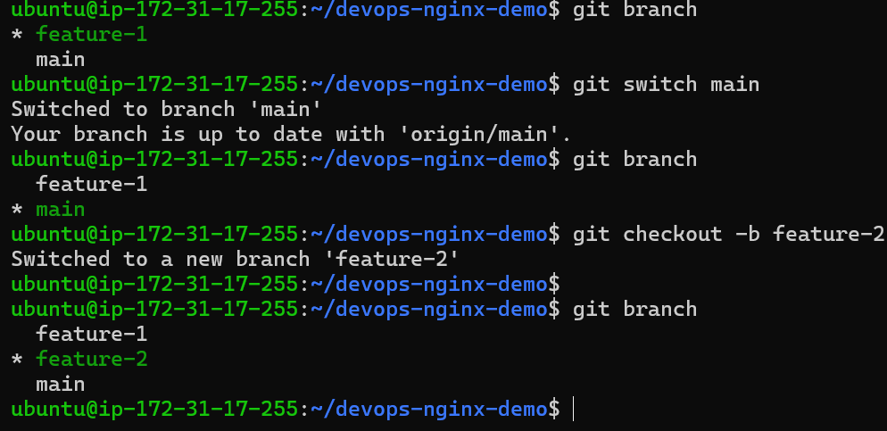

* git switch & git checkout is similar to switch between branches.

     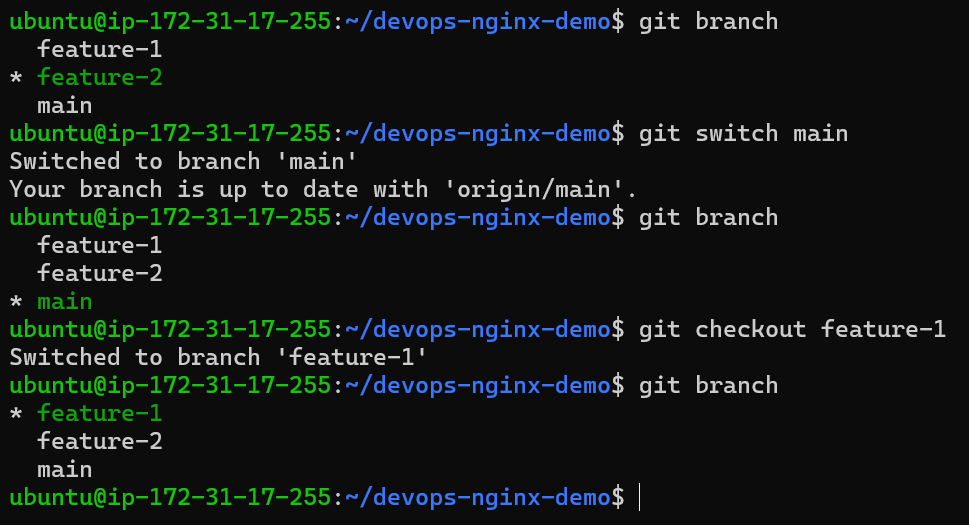

* commit on feature-1 that does not exit on main.

* switch back to main - verify that the commit from feature-1 is not there.

         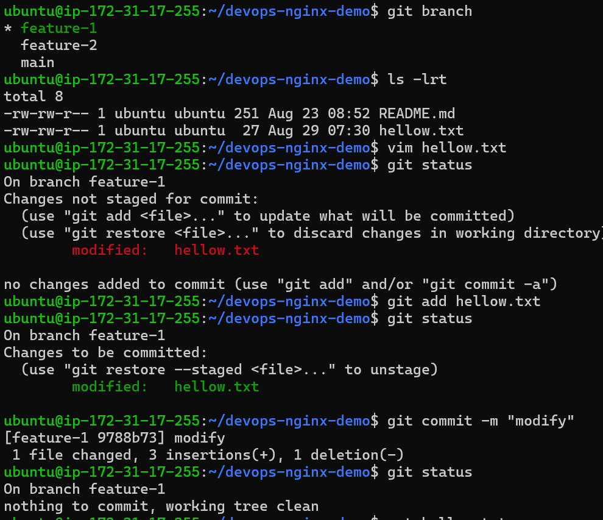

         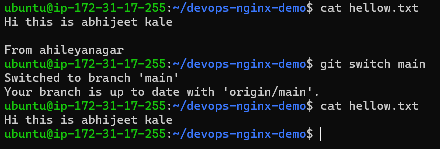

# Delete a branch you no longer need.

     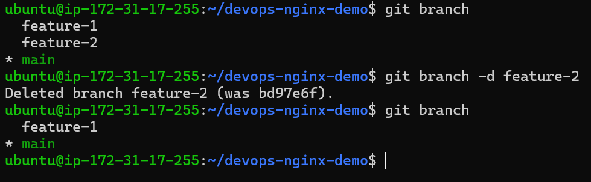

## Push to GitHub 

* Create a new repository on GitHub

   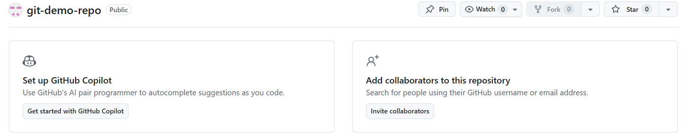

* Connect your local devops-git-practice repo (git-demo-repo) to the GitHub remote
     
     * generate ssh key ssh-keygen

     * & if you have multiple keys then to avoid conflict.and  
        create .ssh/config file in which put this lines

     vim config

         Host github.com
        AddKeysToAgent yes
        IdentityFile ~/.ssh/abhi-demo-key

    * add public key to your github account (setting -->SSH and GPG keys --> New SSH key)
       
         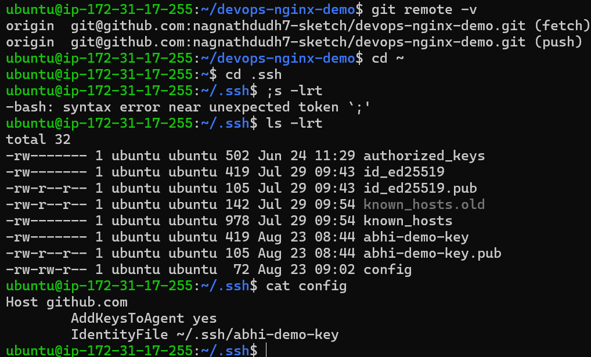

    * Push your main branch to GitHub

        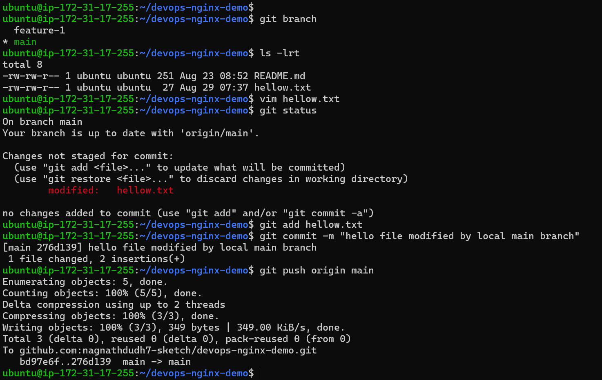

   * Push feature-1 branch to GitHub

        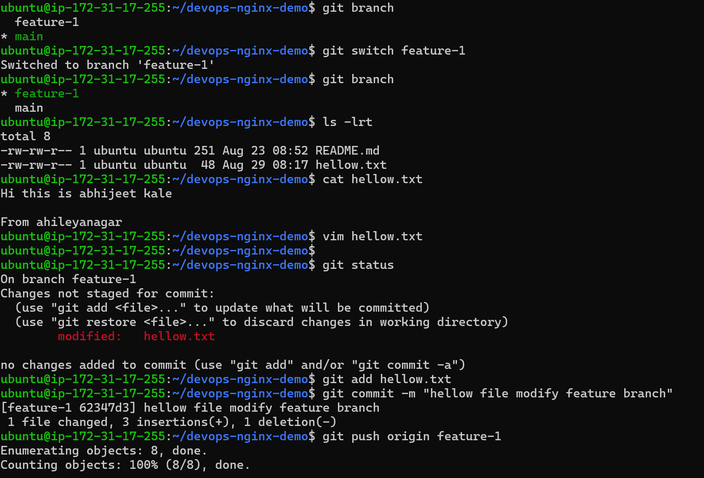

        
        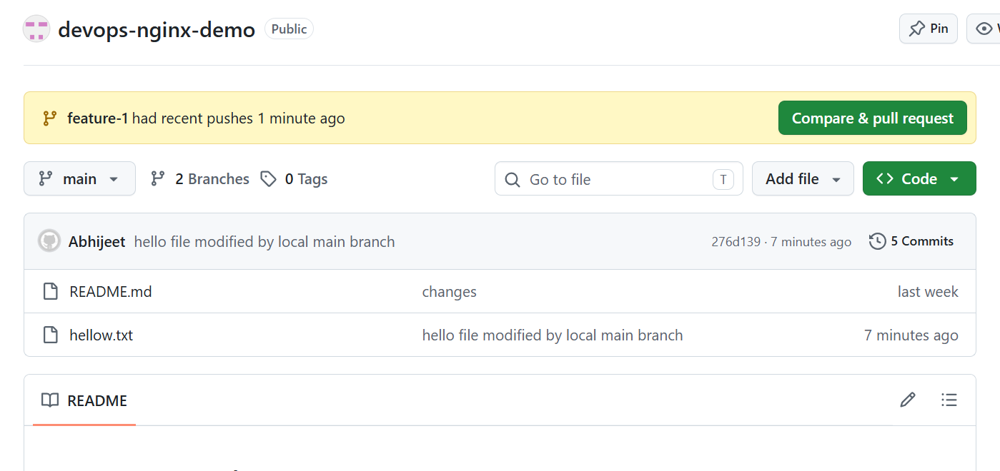

  * Verify both branches are visible on GitHub

      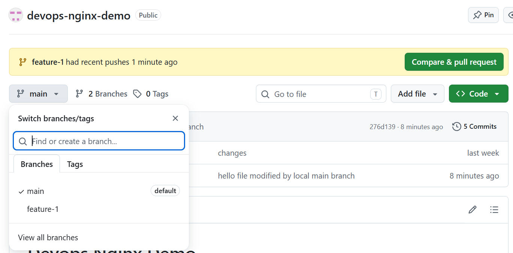

#  difference between origin and upstream

 *  Origin :- When you clone repository git gives default name ORIGIN to remote repository.
 *  upstream:- When you fork repository git gives names to main repository as upstream & your fork  repo as origin on local. 

# Pull from GitHub

   * create a new file directly on GitHub
       
       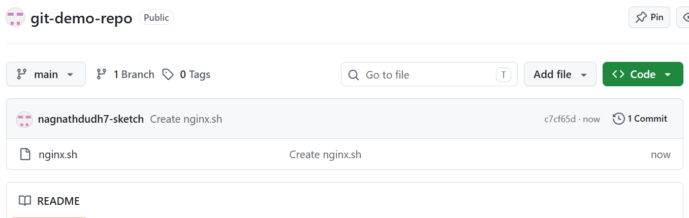

    * push that file into your local 

        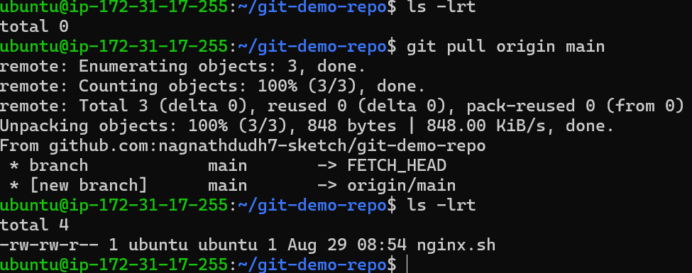

    
# Difference between git fetch and git pull
  * git fetch and git pull. They are both used to get changes from a remote repository (GitHub), but they work differently.
  
  1. git fetch

git fetch downloads the latest changes from GitHub but does NOT change your current working files or branch.

  2. git pull

git pull downloads the changes and integrates them into your current branch.

* git fetch downloads the latest changes from the remote repository without modifying my current branch. git pull downloads the changes and integrates them into my current branch.

## git clone vs fork

  * git clone

  Clone = copy a repository from GitHub to your local computer.
     
      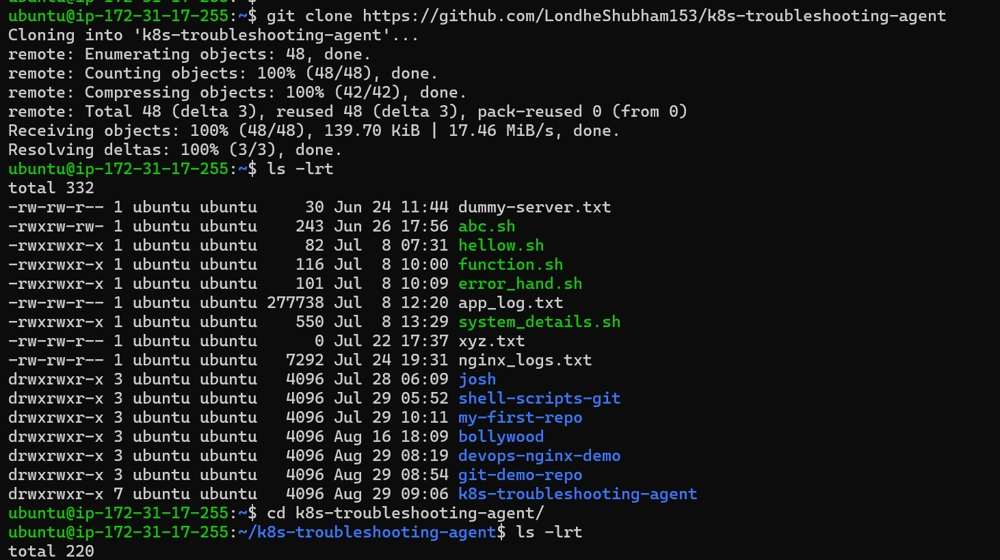

      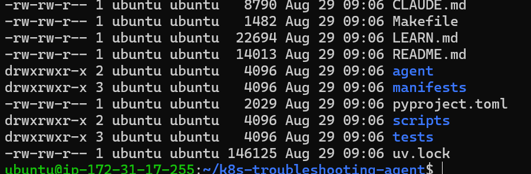

     * You normally clone a repository when you have permission to work with it.

  * Fork

Fork = create your own copy of someone else's repository on GitHub.

       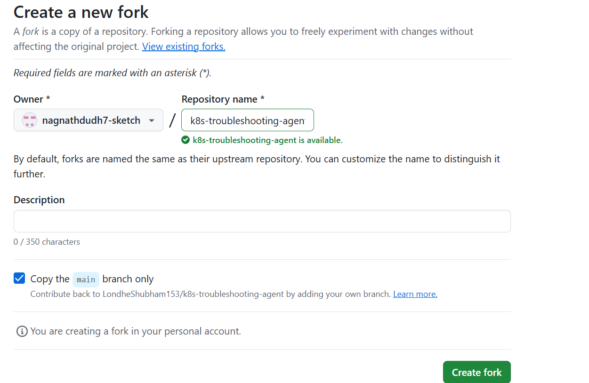

       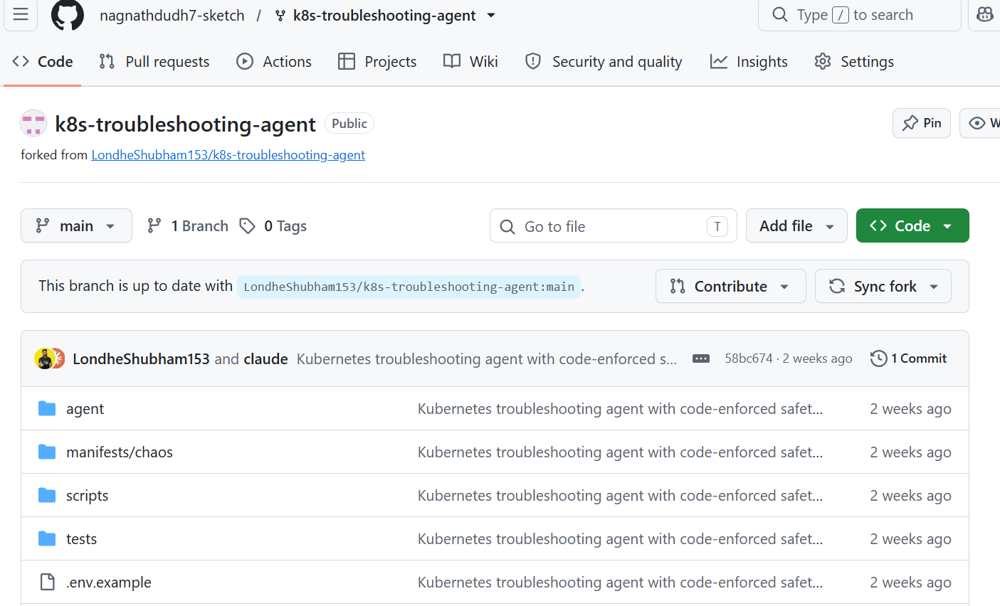

# Main difference

* git clone 

  - Copies repository to your computer.
  - Local operation/command
  - Uses git clone command
  - Used for local development
  - Doesn't create another GitHub repository

* fork

  - Copies repository to your GitHub account
  - GitHub-side operation
  - Usually click Fork on GitHub
  - Commonly used when you don't have write access
  - Creates your own GitHub repository

# Fork = GitHub → GitHub
# Clone = GitHub → Computer

      

   

