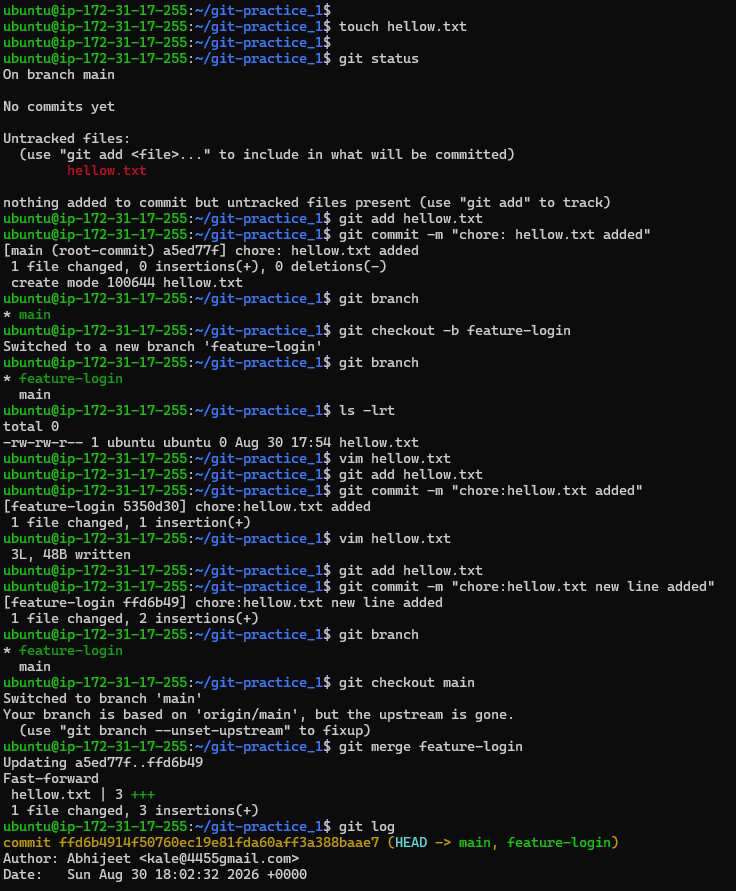
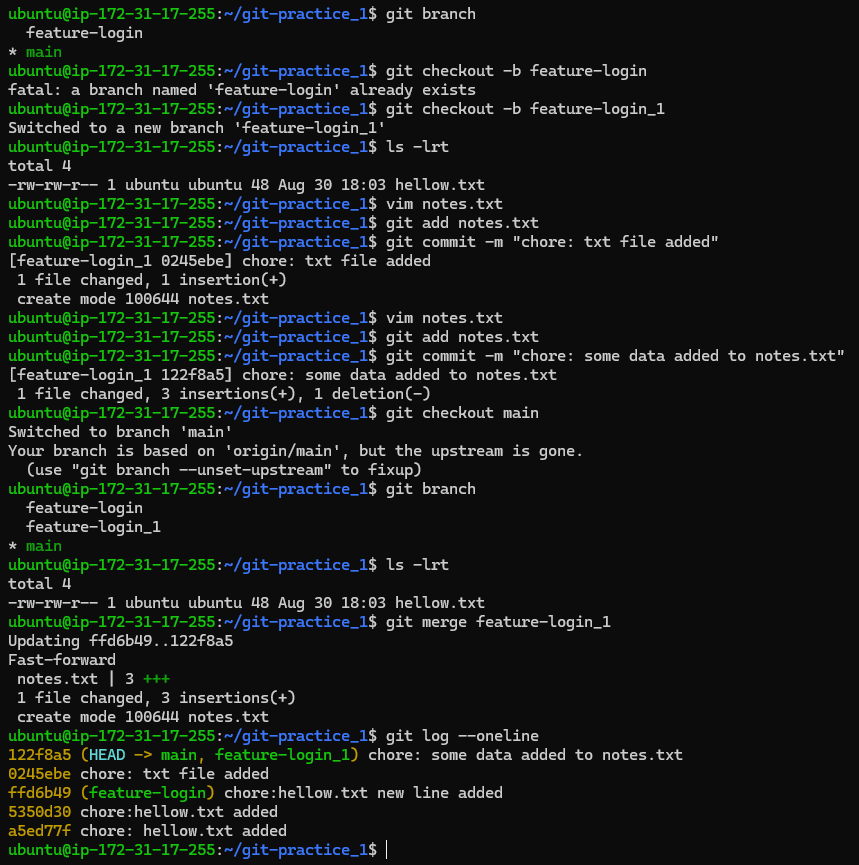

## Advanced Git: Merge, Rebase, Stash & Cherry Pick

* Created feature-login branch from main, and add a couple of commits to it
* Switch back to main and merge feature-login into main
* if there is no any new commit on main branch after creation of branch feature-login It will do a
 * fast-forward merge & there is no merge log
  
    

* created another branch feature-login_1, add commits to it — but also add a commit to main before merging

* Merge feature-login_1 into main

* This time merge commit happens beacause main branch have commit history after creation of branch feature-login_1

     
    
* fast-forward merge

  if there is no any new commit on main branch after creation of branch feature-login_1 It will do a fast-forward merge & there is no commmit history for merge

* merge commit

  If main branch have commit history after creation of branch it will do a merge commit

* merge conflict

  if same file has two version in diff branches & if we are trying to merge then resolve conflict manually